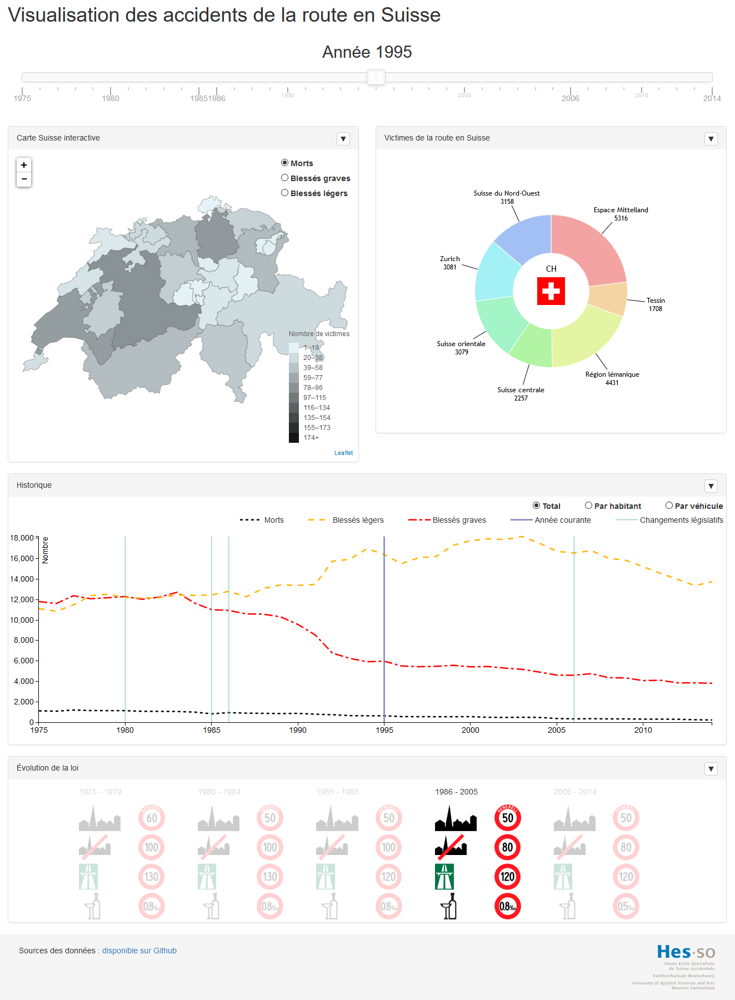

# Information Visualization for Swiss road accidents

Visualization of roads accidents by year

## Installation

### Requirements

* [Node.js](https://nodejs.org)
* [npm](https://docs.npmjs.com/getting-started/installing-node)
* [Bower](http://bower.io/)

### Dependencies

#### npn

	npm install

#### Bower 

	bower install

### Build generated files

	gulp

### Running

The application doesn’t work if the [index.html](index.html) file is open directly. It must running in a web server. All web server are supported, but we recommend Python 3 for a light and easy to use. Python can be run in the root folder with the following command

#### Python 3:

	python -m http.server 8000

The application is now available at [http://localhost:8000](http://localhost:8000)

#### Python 2:

If you don't have update your system and have only Python 2 :

	python -m SimpleHTTPServer 8000
	
## Sources #
- [Population](http://www.bfs.admin.ch/bfs/portal/fr/index/themen/01/02/blank/key/raeumliche_verteilung/kantone__gemeinden.html)
- [Accidents](http://www.bfs.admin.ch/bfs/portal/fr/index/themen/11/06/blank/01/aktuel.html)
- [Speed and Alcohol](http://www.bfu.ch/fr/le-bpa/a-propos-du-bpa/historique)
- [Road signs](https://commons.wikimedia.org/wiki/Road_signs_in_Switzerland)
- [Vehicle](http://www.bfs.admin.ch/bfs/portal/fr/index/themen/11/03/blank/02/01/01.html)
